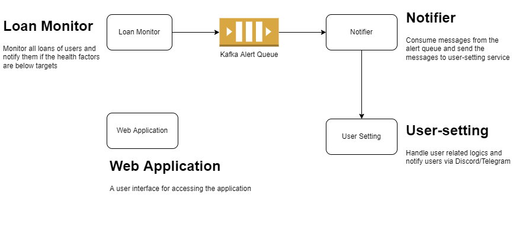

# folks-finance-loan-notification
A notification system where users can set triggers for when they should be notified that their loan is close to being liquidated. It leverages Folks Finance JS SDK. This is a bounty project from https://gitcoin.co/issue/folks-finance/folks-finance-js-sdk/2/100028562
- Allow  users to connect their Discord/Telegram and use them as notification channels

## Project Architecture
<div width="100%">
  
</div>

## Development
Setup environment files by copying .env.example and edit the variables
```shell
$ make prepare.env
```

Setup nodejs dependencies
```shell
$ make prepare.node
```

Run dependencies (zookeeper, kafka, mongodb) in background
```shell
$ make deps.up
```

Create a Kafka topic
```shell
$ make prepare.topic
```

Run monitor-service locally
```shell
$ make monitor.up
```

Run notifier-service locally
```shell
$ make notifier.up
```

Run user-setting-service locally
```shell
$ make user-setting.up
```

Run web application locally
```shell
$ make app.up
```
